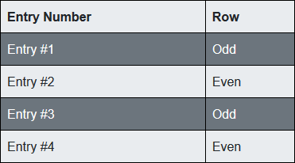

# Introductory Guide for Scraping Internet Pages for Automatic Data Extraction or Testing
Internet contains a vast amount of information and we use web browsers to display that information in a structured way, as web pages. This lets us easily navigate different sites and parse information they have.
Performing this task from perspective of code, would be called web crawling and web scraping, two terms sometimes used interchangeably, but both having something to do with the process of extracting information. How and where that information can be used? There are as many answers, as there are web sites online, and more. This information can be a great resource to build applications around, and knowledge of writing such code can also be used for automated web testing.

# Web Crawling and Scraping
As mentioned previously, these terms are sometimes used interchangeably, but they do have different meanings. Processing a web page and extracting information out of it - is web scraping, while web crawling is an iterative process of finding web links and downloading their content. An application would perform both of these tasks, since finding new links entails scraping a web page for them.

# Downloading Web Content
We'll cover two ways of getting web content, both of them have their pros and cons. First off are basic http requests, having most of the things connected to the internet these days, you will probably find a library for making http requests in any programming language. Advantage to this method, is that it is faster that the second option we'll be discussing, which is using web browsers, such as Firefox and Chrome. While slower, they are so for a reason, rendering styles and executing scripts on web pages behalf, to change how they act and are displayed, so that they would be easily readable and usable. This will use resources and might not be necessarry; if you're trying to extract text from a web page and it can be downloaded as plain text, a simple http request might suffice. However, a lot of web sites rely heavily on javascript and they might not display some content if it is not executed - this is where using a browser eliminates some of the work when getting web content.

# Parsing
Again, we'll cover two ways of doing things, XPath and CSS selectors. XPath is a query language, used for selecting elements in documents such as XML and HTML, since these have a structure to them, a query can be written to follow that structure. Since CSS styles lie on top of HTML structure, CSS selectors are somewhat similar to XPath - a way to select elements using a string pattern. 

# Demo
## Environment
C# and dotnet core 3.1 were used for these examples, however these libraries haven't changed much in a while and should also work on .NET 4.x

Following examples can be cloned as git repository from <git_repo_url>.

Repository also contains a sample web site (aspnet core MVC application), which has 3 pages:
- Page with a simple table
- Page with a 'hidden link'
- Page with a button, which appears after time out

We'll be using these to test different ways of extracting data.

## Http Requests

We'll create a request as follows

```csharp
var request = (HttpWebRequest)WebRequest.Create(<url>);
request.Method = "GET";
```

and we could be done. However, after executing the request, you might not receive what you've expected, a website might check for request headers and refuse to serve content if you don't meet its requirements. Which usually are providing some identity of request and what the response should look like.

```csharp
request.UserAgent = "Mozilla/5.0 (Windows NT 10.0; rv:68.0) Gecko/20100101 Firefox/68.0";
request.Accept = "text/html,application/xhtml+xml,application/xml;q=0.9,image/webp,*/*;q=0.8";
request.Headers.Set(HttpRequestHeader.AcceptLanguage, "en-us,en;q=0.5");
request.Headers.Set(HttpRequestHeader.AcceptEncoding, "gzip,deflate");
``` 

After adding some headers we can request a response and get a response stream.

```csharp
var response = (HttpWebResponse)request.GetResponse();
var responseStream = response.GetResponseStream();
```

Since we've added `AcceptEncoding` header and indicated that we accept `gzip` and `deflate`, we'll check if content is compressed in any way, and decompress it if so.

```csharp
if (response.ContentEncoding?.IndexOf("gzip", StringComparison.InvariantCultureIgnoreCase) >= 0)
{
    responseStream = new GZipStream(responseStream, CompressionMode.Decompress);
}
else if (response.ContentEncoding?.IndexOf("deflate", StringComparison.InvariantCultureIgnoreCase) >= 0)
{
    responseStream = new DeflateStream(responseStream, CompressionMode.Decompress);
}
```

Lastly, we'll convert our `responseStream` to `MemoryStream` to get its byte array, which if read as string, will be HTML content.

```csharp
using var ms = new MemoryStream();
responseStream?.CopyTo(ms);

var htmlContent = Encoding.UTF8.GetString(ms.ToArray());
```
We'll wrap all of this into a single method, so further on `GetHtmlContent(string url)` will be called.

## XPath

To select elements using XPath, there's a library `HtmlAgilityPack`, if you're not running sample projects, this library can be added as a NuGet package.

Steps to use it are
 - Download HTML content
 - Create `HtmlDocument` object from `HtmlAgilityPack` namespace
 - Load HTML content into `HtmlDocument` object

```csharp
var html = GetHtmlContent("http://www.url.com");
var htmlDocument = new HtmlDocument();
htmlDocument.LoadHtml(content);
```

Now a single element or an array of elements can be selected. 

```csharp
var nodeArray = htmlDocument.DocumentNode.SelectNodes("your_xpath_query");
var singleNode = htmlDocument.DocumentNode.SelectSingleNode("your_xpath_query");
```

Notice the word `node`, this refers to HTML being a tree like structure with many nodes, a node can be a single element, it can also be part of the layout ant not be visible, for the purposes of this article and to avoid confusion further on, consider `node` to be an `element`. 

Following queries are based on a simple HTML table 



With structure

```html
<html>
    ...
    <table>
        <tr>
            <th>Entry Number</th>
            <th>Row</th>
        </tr>
        <tr class="odd">
            <td>Entry #1</td>
            <td>Odd</td>
        </tr>
        <tr class="even1">
            <td>Entry #2</td>
            <td>Even</td>
        </tr>
        <tr class="odd">
            <td>Entry #3</td>
            <td>Odd</td>
        </tr>
        <tr class="even2">
            <td>Entry #4</td>
            <td>Even</td>
        </tr>
    </table>
    ...
</html>
```
Where `...` means omitted markup, for brevity.

> If you're running sample web site project, this table can be reached at `http://localhost:5000/scraper/table`.

This won't be a deep dive into all of XPath capabilities, but a few examples of how to select elements, as most of the time these techniques get the job done.

XPath query resembles file system path, so you can think of it that way. `<html>` element is the root, as would be `c:\` drive on Windows and just `/` on Linux. If you wan't to get a file in documents folder, you could do so by writing `c:\Users\user\Documents\File.txt`.

Now replace root drive with `<html>` and the rest of the file path with element names - and you get XPath. Given HTML of the table above, a path to a table cell could be written as `/html/table/tr/td`. Since most web sites are more complicated, with more elements, than the example above, writing queries in such a way might be inefficient, because in can result in a long, hard to read XPath. But just like in searching for files you can use a wildcard (*.txt), there are a few tricks in XPath as well.

XPath for selecting only table cells (`<td>` tags) can be written as `//td`. Putting a forward slash without any tag name after it, is processed as path wildcard, coming back to file system analogy, you could think of it as `*File.txt` where all folders were replaced with `*` wildcard.

```csharp
var nodes = htmlDocument.DocumentNode.SelectNodes("//td");
```

A single node object has a property `InnerText` which we'll be using to print results to console.
We're also replacing newline with empty string, to format each node inner text on a single line.

```csharp
foreach (var node in nodes)
{
    Console.WriteLine(node.InnerText.Replace("\r\n", string.Empty));
}
```

And the output is

```
Entry #1
Odd
Entry #2
Even
Entry #3
Odd
Entry #4
Even
```

Each row represents a text we've selected from inside `<td>` tags.

We'll be selecting whole rows next, by using `<tr>` tag

```csharp
nodes = htmlDocument.DocumentNode.SelectNodes("//tr");
```

We get expected result

```
Entry Number        Row
Entry #1        Odd
Entry #2        Even
Entry #3        Odd
Entry #4        Even
```

However, if we're after just the data in table, this might not be ideal, since we've selected table header as well. 

But looking back at the table HTML, you can see the difference of header not having a class attribute. 

```html
...
<tr>
    <th>Entry Number</th>
    <th>Row</th>
</tr>
<tr class="odd">
    <td>Entry #1</td>
    <td>Odd</td>
</tr>
...
```

This can be used in writing a more precise XPath query, by specifying that we need only elements which have a `class` attribute.

```csharp
nodes = htmlDocument.DocumentNode.SelectNodes("//tr[@class]");
```

Now the output is only rows, without header.

```csharp
Entry #1        Odd
Entry #2        Even
Entry #3        Odd
Entry #4        Even
```

`class` attribute can be replaced with any other (`id`, `src`, etc), and more logic can be added to this query. To select only odd rows, we can select elements which have a `class` attribute with `odd` value.

```csharp
nodes = htmlDocument.DocumentNode.SelectNodes("//tr[@class='odd']");
```

Results in

```
Entry #1        Odd
Entry #3        Odd
```

We can skip element name altogheter, if we're interested only in elements with a class value `odd`

```csharp
nodes = htmlDocument.DocumentNode.SelectNodes("//*[@class='odd']");
```

Same output as with previous result.

```
Entry #1        Odd
Entry #3        Odd
```

Even rows in the above HTML table example also have `class` attributes, however their values differ slightly, by number at the end.

```html
<tr class="even1">
    <td>Entry #2</td>
    <td>Even</td>
</tr>
...
<tr class="even2">
    <td>Entry #4</td>
    <td>Even</td>
</tr>
```

To select these in one go, a query can be written in several ways. 

Using a pipe operator, which means `OR` in XPath, and combining two paths `//tr[@class='even1'] | //tr[@class='even2']`, but this can get inefficient quickly, if you have even a few more paths, not to mention tens or hundres more. 

Another way would be to select only elements with class attributes which start with letter `e` since that would fit our requirement.

```csharp
nodes = htmlDocument.DocumentNode.SelectNodes("//tr[starts-with(@class, 'e')]");
```

And we get the desired output of even rows.

```
Entry #2        Even
Entry #4        Even
```

There's more to XPath and there are plenty of resources online to read up on, however the examples above will cover a lot of needs.

## Javascript

Selecting elements with XPath might not return desired results, as some web sites use javascript to update their html pages, and since requesting such a page with an http request does not execute javascript, you're left with an unchanged document and missing elements.

But that's not the end of that, as we can execute javascript in our C# code.

> If you are running sample web site, you can reach this example at `http://localhost:5000/scraper/link`

For this example we're using HTML document with a `<script>` tag in it, which contains a function which returns a 'secret link'.

```html
<script>
    function secretLinkFunction(){
        return 'https://secret.link';
    };

    var secretLink = secretLinkFunction();
</script>
```

The `secretLink` variable could be used to change HTML document and we're interested in the value of it.

To run javascript in C# code there is more than one library, but we'll be using `Jurassic` which can be downloaded as a NuGet package.

To start off, we'll need to download HTML document to have it as a string in our code.
We're using the same method from XPath example to do so.

```csharp
var content = GetHtmlContent("http://localhost:5000/scraper/link");
```

`<script>` element is just like any other, meaning we can select it using XPath.

```csharp
var htmlDocument = new HtmlDocument();
htmlDocument.LoadHtml(content);

var scriptNode = htmlDocument.DocumentNode.SelectSingleNode("//script");
```

Along with property `InnerText` we've used previously, `scriptNode` contains `InnerHtml` property, which in this case is plain javascript inside `<script>` tag.

```javascript
function secretLinkFunction(){
    return 'https://secret.link';
};

var secretLink = secretLinkFunction();
```

To run this code, we'll create object `ScriptEngine` from `Jurassic` namespace.

```csharp
var scriptEngine = new ScriptEngine();
```

And call `Evaluate` on `InnerHtml` of `scriptNode`.

```csharp
scriptEngine.Evaluate(scriptNode.InnerHtml);
```

Now the code has been executed and in theory there should be a variable `secretLink` with a string value, to check if it's true, `ScriptEngine` allows to get a variable by name.

```csharp
var javascriptLink = scriptEngine.GetGlobalValue<string>("secretLink");
Console.WriteLine(javascriptLink);
```

And the output is as expected

```
https://secret.link
```

## Using Web Browsers

Downloading HTML content using a browser entails less code than using http requests, but then there is added time impact of browser start up time, and also web page load time, as browser has to render it with provided styles and scripts. 

To download content using a web browser, a webdriver is required, which is a piece of software, that provides platform and language neutral interface, to control a web browser.

Each browser has its own webdriver, if you are using sample projects, build `SeleniumScraper` project and you'll find `geckodriver` for Firefox and `chromedriver` for Chrome in build directory.

Controlling a webdriver is done via `Selenium`, which is a framework for testing web applications. It provides domain-specific language to use it, and we'll be using a C# wrapper written on top of it. 

To continue further, we require an actual browser, sample project is based on `Firefox` and `Chrome` and to run examples you'll need to install either one. You can also use a protable version of a browser, that way you don't need to install it on your machine, just provide binary executable path when instantiating web driver object.

`SeleniumScraper` project has several dependencies

```
Selenium.WebDriver
Selenium.Firefox.WebDriver
Selenium.Chrome.WebDriver
```

These are needed to use Selenium in general and for our specific browsers.
This is actually enough to compile an application, but calling any method would result in error, as we're missing web driver software for Firefox/Chrome. Web drivers can be downloaded manually or by adding following NuGet packages which contain respective driver executables.

```
Selenium.Mozilla.Firefox.Webdriver
Selenium.WebDriver.ChromeDriver
```

Creating Firefox and Chrome driver instances in C# code is the same.

```csharp
var options = new FirefoxOptions();
var webDriver = new FirefoxDriver(options);
```

```csharp
var options = new ChromeOptions();
var webDriver = new ChromeDriver(options);
```

These are different implementations of `DriverOptions` and `RemoteWebDriver` interfaces.

Downloading web content is one line of code, here we'll be using the same table example as with http requests and XPath previously.

```csharp
webDriver.Navigate().GoToUrl("http://localhost:5000/scraper/table");
```

HTML content can now be accessed using `PageSource` property.

```csharp
webDriver.PageSource
```

Running web driver as is will result in a browser window showing up. If you want to avoid that, for whatever reason, you can add a parameter to `DriverOptions`. `--headless` will stop browser window from poping up, and not seeing it does not make any difference from application perspective. Headless browser can be used in the same way as a one with window, you can even take screenshots. 

```csharp
options.AddArgument("--headless");
```

## CSS Selectors

If you ever had a chance to add some styles to a web page, this should be familiar. CSS selectors are used to select an element, or an array of elements, browsers are doing this to add styles as required, we will be doing this to extract data.

Following examples are based on the same HTML table as in XPath section


With structure

```html
<html>
    ...
    <table>
        <tr>
            <th>Entry Number</th>
            <th>Row</th>
        </tr>
        <tr class="odd">
            <td>Entry #1</td>
            <td>Odd</td>
        </tr>
        <tr class="even1">
            <td>Entry #2</td>
            <td>Even</td>
        </tr>
        <tr class="odd">
            <td>Entry #3</td>
            <td>Odd</td>
        </tr>
        <tr class="even2">
            <td>Entry #4</td>
            <td>Even</td>
        </tr>
    </table>
    ...
</html>
```

Logic in writing CSS selectors is somewhat similar to XPath, you are defining a path to an element, it can be explicit, and it can also contain wildcards.

To select all rows in the example table and do so explictly, CSS selector might look like this

```csharp
html > table > tr
```

But it can also be shortened as so

```
tr
```

And the output would be the same

```
Entry Number Row
Entry #1 Odd
Entry #2 Even
Entry #3 Odd
Entry #4 Even
```

There's no need to add any more syntax (with XPath this would require two forward slashes) to indicate a wildcard in element path.

Not only it is possible to select an element with a certain attribute, you can also provide expected attributes value. 

To avoid selecting header from example table, we can select all `tr` elements which have a `class` attribute, as header lacks it. We can do so by calling `FindElementsByCssSelector` method on web driver.

```csharp
var elements = webDriver.FindElementsByCssSelector("tr[class]");
```

Web driver returns a collection of `IWebElement`, which contains a property `text` - the equivavelt of `InnerText` we used with `HtmlAgilityPack`. Calling it on each of our elements produces following result

```
Entry #1 Odd
Entry #2 Even
Entry #3 Odd
Entry #4 Even
```

Selecting odd rows requires specifying `class` value to be `odd`, as per HTML table above.

```csharp
var elements = webDriver.FindElementsByCssSelector("tr[class='odd']");
```

Just like with XPath, symbol `*` can be used as a wildcard instead of elements name.

```csharp
var elements = webDriver.FindElementsByCssSelector("*[class='odd']");
```

Both selectors present us with same result

```
Entry #1 Odd
Entry #3 Odd
```

CSS selectors can also perform string checks, like `starts with`, `contains`, however special syntax is used instead of whole words, to select rows which contain `e` in their `class` attribute, following selector fits the job

```csharp
var elements = webDriver.FindElementsByCssSelector("tr[class*='e']");
```

Notice `*` symbol after `class`.

Printing results we can see only even rows

```
Entry #2 Even
Entry #4 Even
```

## Javascript

Although the browser executes javascript on its own and you don't need a script engine to run it yourself, it can still pose a problem. The reason is again the same, when you download a web page and try to select an element, it might not be there yet.

If you run the sample web page and navigate to `http://localhost:5000/scraper/button` you'll find a simple layout and some text, but after waiting for 2 seconds, a button will appear.

It has two attributes, `href` and `class`

```html
<a href="https://secret.link" class="btn btn-primary">Secret Button</a>
```

And is added using following script

```javascript
setTimeout(function (){
    var element = document.getElementById('container');

    var button = document.createElement('a');
    button.setAttribute('href', 'https://secret.link');
    button.setAttribute('class', 'btn btn-primary');
    button.innerHTML = 'Secret Button';

    element.appendChild(button);
}, 2000);
```

Instead of specifying entire class for CSS selector, we can specify a string check for `class` to start with `btn`

```
a[class^='btn']
```

Notice the `^` symbol after `class`.

To make it cleaner, this selector can be replaced with just `.btn`, where `.` indicates `class` attribute of an element and `btn` is our string check for said attribute. You can find this in a  method of example project which uses the shorter selector.

```csharp
static IWebElement FindButton()
{
    return _webDriver.FindElementByCssSelector(".btn");
}
```

If you call `FindElementsByCssSelector` right after downloading HTML content of sample page, it will throw an exception, saying there's no such element. What we need to do is simply wait 2 seconds. It could be simply done by adding `Thread.Sleep(2000)`, after thread continues it will find the button, but instead of hardcoding the value of wait time, this can be achieved in a more dynamic way.

`OpenQA.Selenium.Support.UI` namespace contains a class `WebDriverWait` which, as parameters, takes a web driver object and `TimeSpan` object which indicates time out when waiting for an element.

Using `FindButton` method we can wait for button to appear by writing following

```csharp
new WebDriverWait(_webDriver, TimeSpan.FromSeconds(10))
    .Until(_ =>
    {
        try
        {
            var button = FindButton();
            return button.Displayed;
        }
        catch
        {
            return false;
        }
    });
```

The time out is set to 10 seconds, but the button appears after 2 seconds, at which point method `Until` receives value `true` and code continues execution.

Now we can safely call `FindButton` outside wait context, knowing that it is there, and try to get value of attribute `href`

```csharp
var button = FindButton();
var secretLink = button.GetAttribute("href");
Console.WriteLine(secretLink);
```

The buttons secret is no more and we can see the result

```
https://secret.link/
```


## Conclusion

These techniques can be mixed and matched, sometimes javascript on a web site can be obfuscated so much, that it is easier to let browser execute it instead of using script engine. At times XPath can prove the only way to extract data, as it can be used on `xml` documents as well as `html`, while CSS selectors can not. Whatever the problem, you now have a solution at hand.
